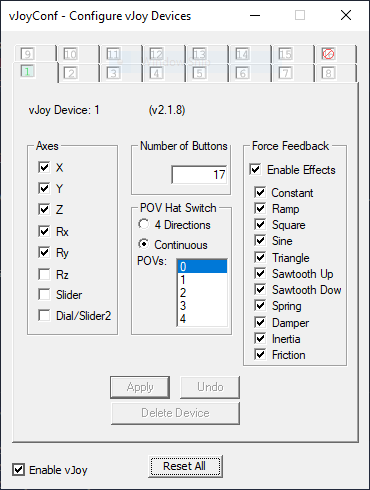
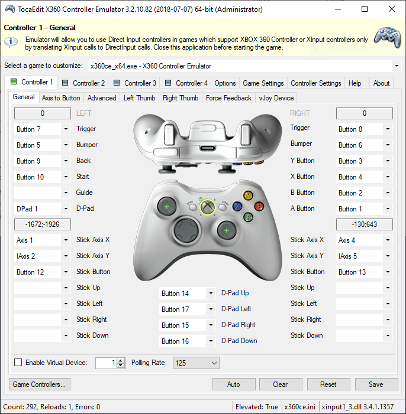

# PS4 Controller Simulation with vJoy

This project simulates a PS4 controller using an Android phone, allowing it to interact with a Windows PC as if it were a physical controller. The project uses ADB (Android Debug Bridge) to capture inputs from the phone and `vJoy` to simulate the controller on Windows.

- [Overview](#overview)
- [Requirements](#requirements)
- [Setup](#setup)
- [Getting the `controller_device_path`](#getting-the-controller_device_path)
- [vJoy Configuration](#vjoy-configuration)
- [Running the Script](#running-the-script)
- [Making It Work in Games Using x360ce](#making-it-work-in-games-using-x360ce)
- [File Descriptions](#file-descriptions)
- [Troubleshooting](#troubleshooting)
- [Controller Mapping](./MAPPING.md)
## Overview 

-   **Main Components**:

    -   `main.py`: The entry point of the application. It sets up signal handling for graceful shutdown and starts listening for controller input.

    -   `controller.py`: Listens for input events from the Android phone using ADB, processes the events, and forwards them to `vJoy`.

    -   `event_handler.py`: Handles specific events such as button presses, triggers, and stick movements, translating them into vJoy actions.

    -   `utils.py`: Utility functions for scaling inputs and parsing D-pad values.

    -   `config.py`: Configuration file with mappings for buttons, triggers, and axes.

## Requirements 

1.  **Python 3.x**\
    Ensure you have Python 3 installed on your system.

2.  **Dependencies**:

    -   `pyvjoy`: Python bindings for the vJoy API, which simulates the controller.

    -   `subprocess`: Used to interact with ADB and read the input events from the Android device.

    -   `concurrent.futures`: Used for handling controller events asynchronously with a thread pool.

    -   `logging`: For logging and debugging purposes.

    You can install the necessary dependencies using `pip`:

    ```shell
        pip install pyvjoy
    ```

3.  **ADB Setup**:

    -   Ensure [ADB](https://developer.android.com/studio#downloads) is installed and properly configured on your machine. You'll need to connect your Android device via USB and enable USB debugging on the device.

4.  **vJoy Setup**:

    -   You need to install [vJoy](https://vjoystick.sourceforge.io/) on your Windows machine to simulate the virtual controller. Ensure that the vJoy device is properly set up.

## Setup 

1.  **Clone the repository**:

    ```shell
        git clone https://github.com/itachi-555/PS4ControllerSimulator
        cd PS4ControllerSimulator
    ```

2.  **Android Device Configuration**:

    -   Enable **USB Debugging** on your Android phone and connect it to your PC.

    -   Install `adb` on your machine and ensure that your Android device is recognized by running:

        ```shell
            adb devices
        ```

3.  **vJoy Configuration**:

    -   Install and configure vJoy on your Windows PC, ensuring that a virtual joystick is created and ready to be used by the script.

## Getting the `controller_device_path` 

To identify the correct device path for your Android controller, follow these steps:

1.  **Connect your Android device** via USB and ensure that **USB debugging** is enabled.

2.  **Run the following command in your terminal**:

    ```shell
        adb shell getevent -i
    ```

3.  **Look for the device entry** in the output, which will resemble the following:

    ```shell
    add device 1: /dev/input/event7
      bus:      0005
      vendor    054c
      product   09cc
      version   8000
      name:     "Wireless Controller"
      location: "70:28:04:61:45:ee"
      id:       "a4:53:85:5e:ec:b1"
      version:  1.0.1
      events:
        KEY (0001): 0130  0131  0133  0134  0136  0137  0138 0139
                    013a  013b  013c  013d  013e
        ABS (0003): 0000  : value 144, min 0, max 255, fuzz 0, flat 15, resolution 0
                    0001  : value 122, min 0, max 255, fuzz 0, flat 15, resolution 0
                    0002  : value 27, min 0, max 255, fuzz 0, flat 15, resolution 0
                    0003  : value 129, min 0, max 255, fuzz 0, flat 15, resolution 0
                    0004  : value 124, min 0, max 255, fuzz 0, flat 15, resolution 0
                    0005  : value 0, min 0, max 255, fuzz 0, flat 15, resolution 0
                    0010  : value 0, min -1, max 1, fuzz 0, flat 0, resolution 0
                    0011  : value 0, min -1, max 1, fuzz 0, flat 0, resolution 0
        MSC (0004): 0004
        FF  (0015): 0050  0051  0058  0059  005a  0060
      input props:
        <none>
    ```

4.  **Locate the path** of the device in the `add device` line (e.g., `/dev/input/event7`). This is the value you need for `controller_device_path` in the `config.py` file.

5.  **Update** `config.py`** with the correct device path:

    ```python
        # In config.py
        controller_device_path = "/dev/input/event7" # Update this path
    ```
    
## vJoy Configuration 

To simulate a PS4 controller with vJoy, make sure that the vJoy configuration includes all the necessary buttons and axes. Specifically, you should have `17` buttons defined to simulate all PS4 controller buttons.
open `vJoyCon.exe` and edit `Number of Buttons` :
* * * *
<p align="center">
  
</p>

* * * *

## Running the Script 

To run the project, execute the `main.py` script:

```shell
    python main.py
```

This will:

-   Start listening for controller input from the Android device via ADB.

-   Map the input events (buttons, sticks, D-pad, etc.) to vJoy actions, simulating a PS4 controller on your Windows PC.

### Graceful Shutdown

The  application will continue running, listening for inputs. To shut it down, use `Ctrl+C` or send a `SIGTERM` signal to stop the script gracefully.

## Making It Work in Games Using x360ce 

To use the simulated PS4 controller in games that require an Xbox 360 controller, you'll need to map the vJoy inputs to Xbox 360 controller inputs using **x360ce**. Here's how to set it up:

1.  **Download and Install x360ce**:

    -   Download the **x360ce** software from [x360ce official website](https://www.x360ce.com/).

    -   Extract the contents to the folder of the game or to a separate directory where you want to manage the configuration.

2.  **Configure x360ce**:

    -   Run the `x360ce.exe` application.

    -   The software will scan your connected devices and automatically detect the virtual controller created by vJoy.

    -   If it's not automatically detected, make sure the vJoy device is active and try refreshing or restarting x360ce.

3.  **Map vJoy to Xbox 360 Controller**:

    -   Once your controller is detected, you'll need to map the buttons and axes correctly. You can do this manually or use the **Auto** feature in x360ce.

4.  **Use the Mapping Image**:

    -   To make the mapping process easier, refer to the following screenshot which shows the x360ce controller mapping setup:
    * * * *
    <p align="center">  </p>

    The image shows the mapping of buttons, triggers, and axes from the virtual PS4 controller (via vJoy) to Xbox 360 controller inputs. Follow the mapping in the image for a seamless experience in compatible games.
    * * * *

1.  **Save the Configuration**:

    -   After mapping the buttons and axes, save the configuration file (`x360ce.ini`) in the game folder.

    -   Make sure to launch the game with the `x360ce` executable or ensure it runs alongside the game as required.

2.  **Test the Controller**:

    -   Launch the game and test the controller to verify that all buttons and axes are functioning correctly. 

## File Descriptions 

-   `main.py`: Initializes the application and listens for controller input. Handles graceful shutdown on `SIGINT` or `SIGTERM`.

-   `controller.py`: Captures and processes input events from the Android phone and sends them to vJoy.

-   `event_handler.py`: Processes individual input events like button presses and stick movements.

-   `utils.py`: Contains helper functions like scaling input values and parsing D-pad button states.

-   `config.py`: Contains mappings for controller buttons, triggers, and axes.

## Troubleshooting 

-   **ADB not detecting device**: Ensure that USB debugging is enabled and the phone is properly connected via USB. Run `adb devices` to check if the device is listed.

-   **vJoy device not recognized**: Ensure that vJoy is installed and the virtual joystick is set up correctly. Check the vJoy configuration in the vJoy Control Panel.

-   **Permission issues**: Make sure you have the necessary permissions to interact with ADB and the vJoy device on your machine.
* * * *
